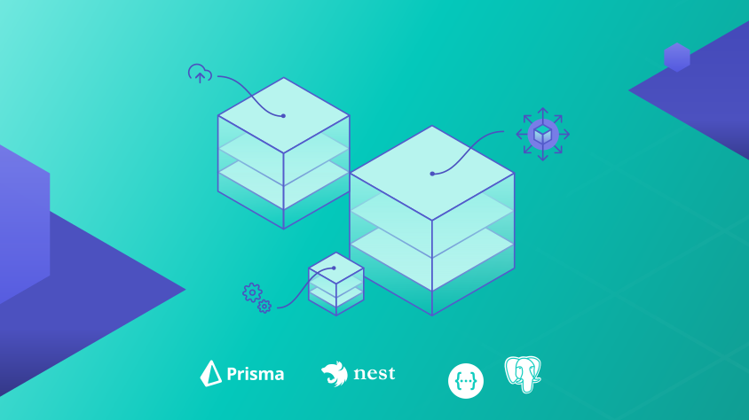
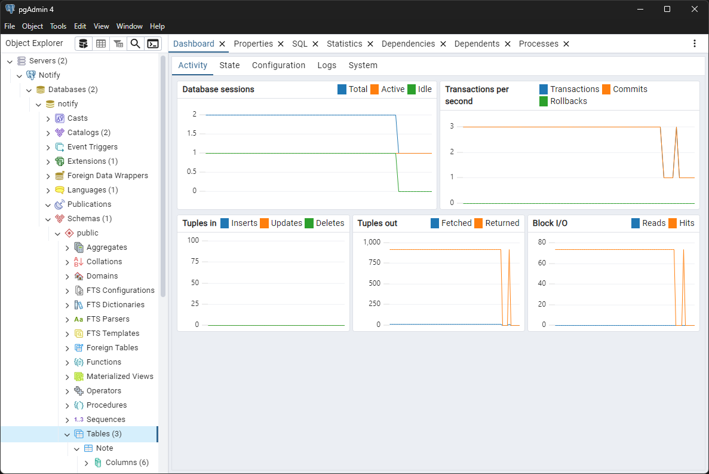
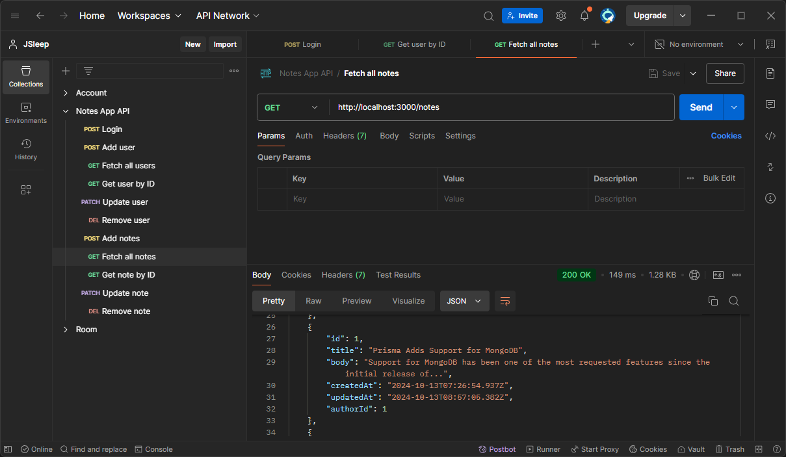
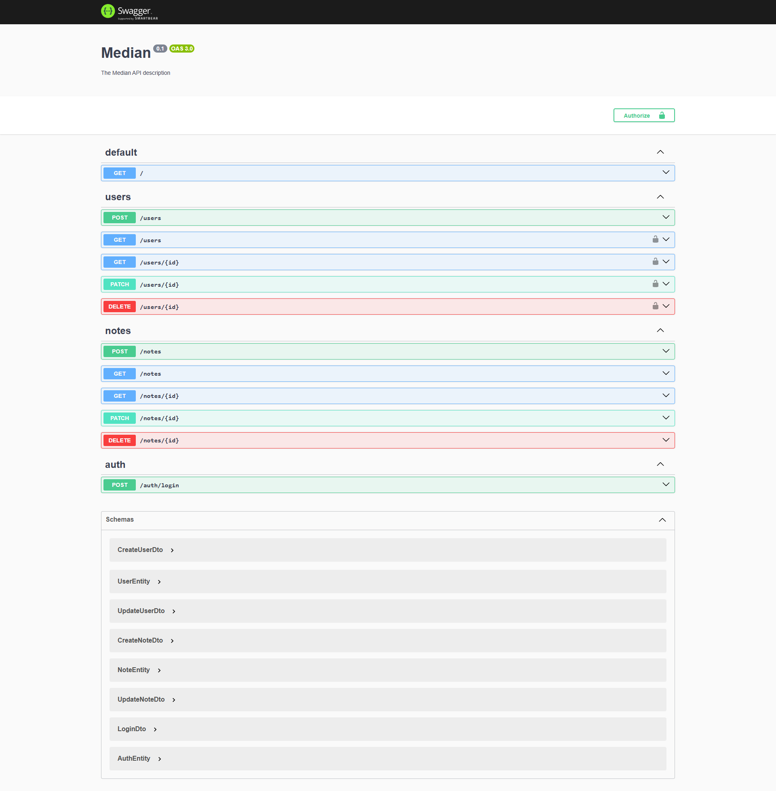
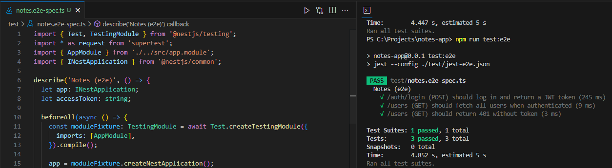

  <h1 align="center">Nest.js + PostgreSQL + Prisma</h1>

## What is Notify?
Notify is a simple Notes CRUD app built using Nest.js, PostgreSQL, and Prisma as the ORM. The app allows users to register, log in, and manage personal notes with full Create, Read, Update, and Delete (CRUD) functionality. User authentication is implemented using JWT (JSON Web Token) to ensure secure access, and bcrypt is used to hash and verify passwords. Swagger is integrated for API documentation, enabling developers to easily explore and test the APIs. The project also includes comprehensive End-to-End (E2E) testing to validate the correctness of the application, focusing on user routes and authentication workflows.

## REST API
### User Authentication
1. `POST /auth/login`: Authenticates the user by verifying the credentials and returns a JWT access token for authorized requests.
2. `POST /users`: Registers a new user by providing a name, email, and password.
3. `GET /users`: Fetch all existing users.
4. `GET /users/{id}`: Fetch an existing user based on its ID.
5. `PATCH /users/{id}`: Update an existing users' credentials, such as name, email, or password.
6. `DELETE /users/{id}`: Delete an existing user.

### Notes Management
1. `POST /notes`: Creates a new note associated with the authenticated user.
2. `GET /notes`: Retrieves a list of all notes belonging to the authenticated user.
3. `GET /notes/{id}`: Fetch an existing note based on its ID for the authenticated user.
4. `PATCH /notes/{id}`: Updates a note's title or content based on its ID for the authenticated user.
5. `DELETE /notes/{id}`: Deletes a note based on its ID for the authenticated user.

## Modular Design Pattern
Notify uses a **modular architecture** where features are split into modules. Each module in the app is designed to encapsulate a specific domain. This structure promotes separation of concerns and makes the application highly maintainable and scalable. It also improves reusability as modules can be easily plugged into other applications.

Furthermore, the app also utilizes **controller-service pattern** to handle incoming requests and business logic separately. Controllers handle HTTP requests, validate inputs, and delegate business logic to the corresponding services. Services contain the core business logic, such as authentication, note management, or user management. This pattern enhances code maintainability by clearly delineating the roles of controllers and services.

Finally, **DTOs (Data Transfer Object)** are used to define the structure of the data being sent between the client and the server. This ensures that only the required data is passed and processed, improving validation, security, and performance.

## Database
This project uses a local PostgreSQL database to store user and note data securely. Prisma ORM is integrated with the application to simplify database interactions, providing an easy-to-use interface for querying, creating, updating, and deleting records. Prisma's schema file is used to define the database models, which are then automatically synced with the PostgreSQL database through migrations.

## API Documentation

**Postman**

**Swagger UI Express**

## E2E Testing

The project includes an End-to-End (E2E) testing feature designed to ensure the core functionality of the application works as expected. A primary focus of the E2E tests is to verify the API token functionality, where the authentication flow is tested by simulating a user login and checking if a valid JWT token is generated.

